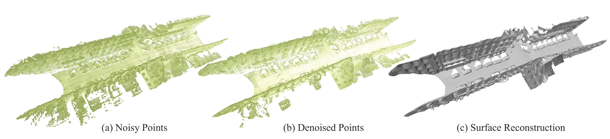

# Learning Signed Distance Functions from Noisy 3D Point Clouds via Noise to Noise Mapping (ICML 2023 Oral)

<h2 align="center"><a href="https://mabaorui.github.io/Noise2NoiseMapping/">Project Page</a> | <a href="https://mabaorui.github.io/">Personal Web Page</a> | <a href="https://arxiv.org/abs/2306.01405">Paper</a></h2>

<p align="left">
  
</p>

This repository contains the code to reproduce the results from the paper.
<a href="https://arxiv.org/abs/2306.01405">Learning Signed Distance Functions from Noisy 3D Point Clouds via Noise to Noise Mapping</a>
<!-- [Learning Signed Distance Functions from Noisy 3D Point Clouds via Noise to Noise Mapping](pdf/learning_signed_distance_funct.pdf). -->

You can find detailed usage instructions for preprocessing data and training your own models below.

## Installation
First you have to make sure that you have all dependencies in place.
The simplest way to do so, is to use [anaconda](https://www.anaconda.com/). 

You can create an anaconda environment called `tf` using
```
conda env create -f tf.yaml
conda activate tf
```

## Data Processing

First downloading the dataset you would like to use (e.g.  <a href="https://shapenet.org/">ShapeNet</a>). Then you can generate the noisy point cloud data for training as:

```
python gen_noise.py /PATH/TO/YOUR/DATA/dataname.ply(obj,off,etc.) /PATH/TO/SAVEDATA/savename.ply
```

You can simply modify the code for processing your own data.

## Training
You can now train the network by runing 

```
python noise2noise.py --dataname savename --data_dir /PATH/TO/SAVEDATA --CUDA 0 --out_dir /PATH/TO/OUTPUT --train --save_idx -1
```

## Related work
```bash
Pytorch 
https://github.com/mabaorui/NeuralPull-Pytorch
https://github.com/junshengzhou/CAP-UDF
Tensorflow
https://github.com/mabaorui/NeuralPull
https://github.com/mabaorui/OnSurfacePrior
https://github.com/mabaorui/PredictableContextPrior
```

## Citation

If you find our code or paper useful, please consider citing

    @inproceedings{BaoruiNoise2NoiseMapping,
        title = {Learning Signed Distance Functions from Noisy 3D Point Clouds via Noise to Noise Mapping},
        author = {Baorui Ma and Yu-Shen Liu and Zhizhong Han},
        booktitle = {International Conference on Machine Learning (ICML)},
        year = {2023}
    }

## Surface Reconstruction Demo
<p align="left">
  
</p>

<p align="left">
  
</p>

